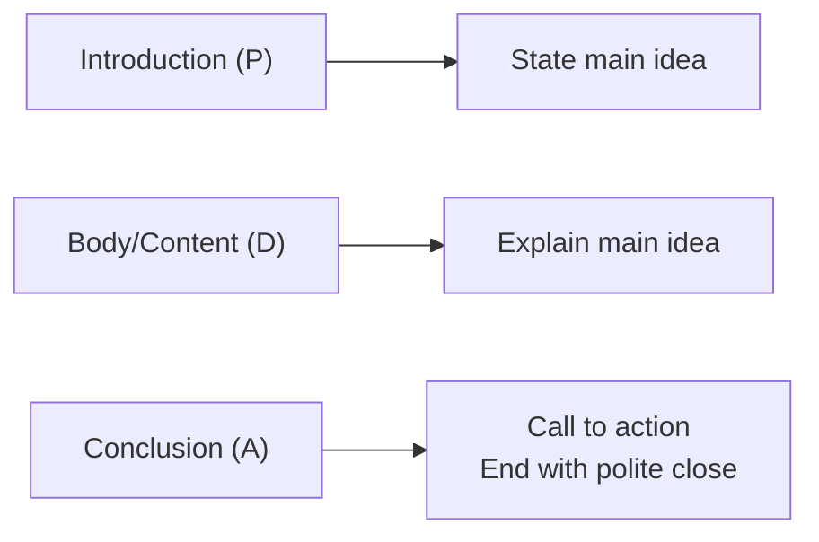
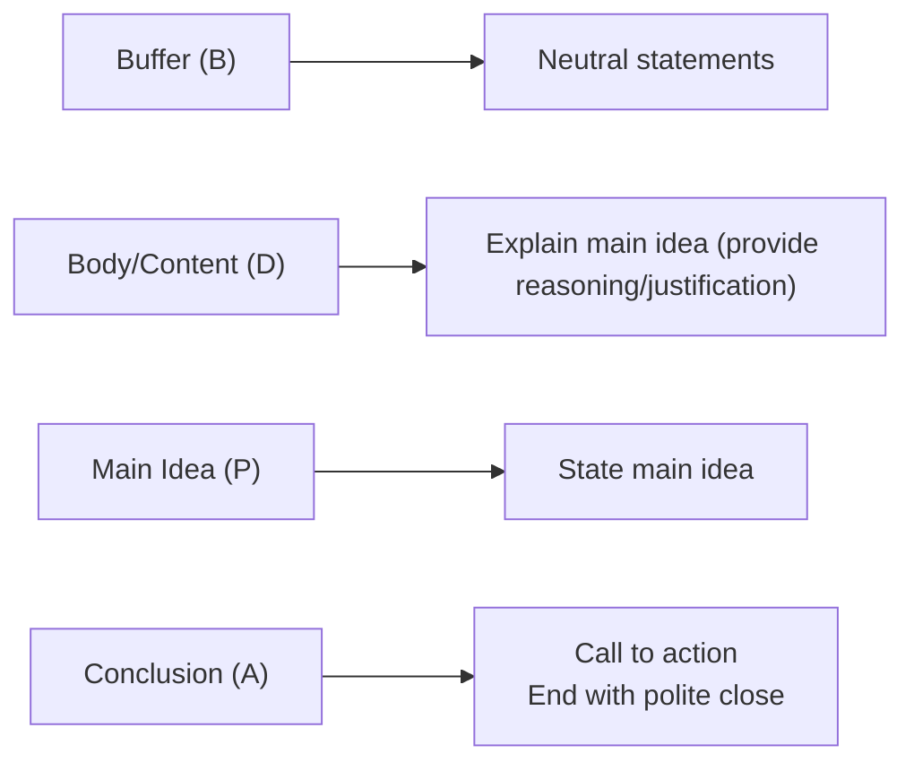

# Approaches to Writing

**Direct + Indirect = Business Messages**

## Direct Approach

* Used when sharing good, neutral, or some bad news.

## Indirect Approach

# Buffer

* Buffer is a neutral, noncontroversial statement that is closely related to the point of message.

## Attention of Writing Buffer

* Be neutral.
* Less than three short sentences.
* Don't imply a negative statement.

| Buffer                 | Neutral Statement                                                                                                                                                                                            |
| ---------------------- | ------------------------------------------------------------------------------------------------------------------------------------------------------------------------------------------------------------ |
| Explain Reasons        | 1. Provide relevant details.   2. Highlight on important reasons/justification.   3. Make sure the justification is clear to help the audience to accept the bad news.                                 |
| State or Imply Refusal | 1. State the bad news.   2. De-emphasize on the bad news.   3. Avoid over-apologizing.                                                                                                                 |
| Polite Close           | 1. Maintain a positive tone, instead of apologizing.   2. Limit future correspondence. Encourage additional communication only if you are willing to discuss your decision further.   3. End politely. |

# Conclusion

|              | Direct Approach                                         | Indirect Approach             |
| ------------ | ------------------------------------------------------- | ----------------------------- |
|              | Routine request, good news, and some bad news messages. | Bad news messages.            |
| Introduction | Main idea/Purpose: ***                                  | Buffer-Neutral Statement      |
| Content      | Explanation of main idea/purpose                        | Reasons and main idea/purpose |
| Conclusion   | Polite close                                            | Polite close                  |