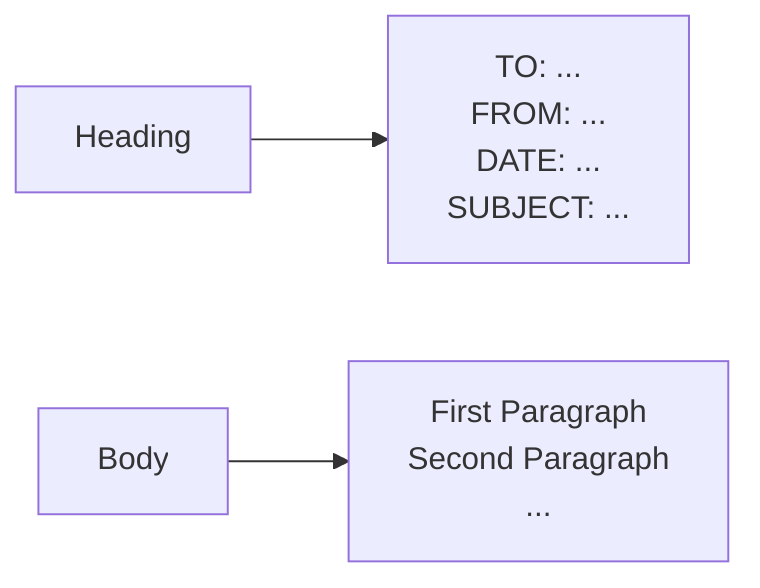
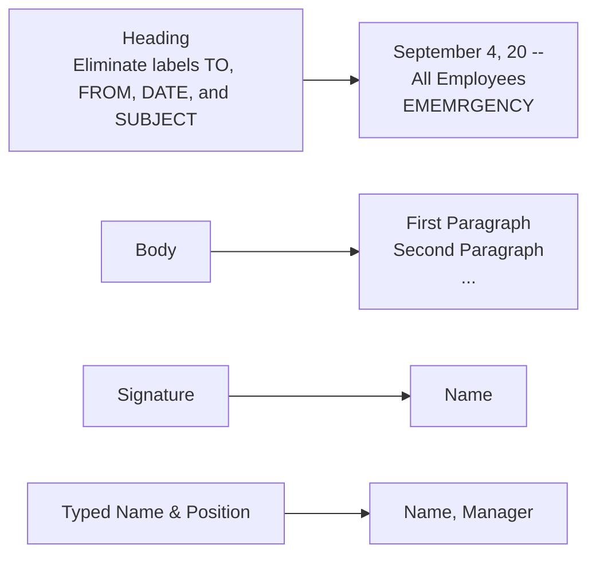

# Definition of Business Memo

* A slightly short document used to transmit information within an organization.
* Memos are characterized by being brief, direct, and easy to navigate.
* Less formal than letters, but should maintain a professional style.

# Purpose of Memorandum

* Provide or request factual information.

# Types of Memo

## Traditional Memo

## Simplified Memo

# Paragraphing of Memo

* Memo should not be long.
* Minimum 2, Maximum 4. Generally 2 to 3 paragraphs.

## Introduction Paragraph

* Provide **main purpose** of the memorandum.
* Briefly explain on the main idea.

## Body Paragraph (Explanation)

* Explain all the relevant information.
* Ensure the audience clear with all the points (explanation) given.

## Conclusion Paragraph

* General conclusion
* Be direct.

# Tips for Writing Effective Memos

* Keep memos brief and to the point.
* One topic per memo.
* Avoid using memos for bad news.
* Tone must be appropriate.
* State purpose clearly in memo.