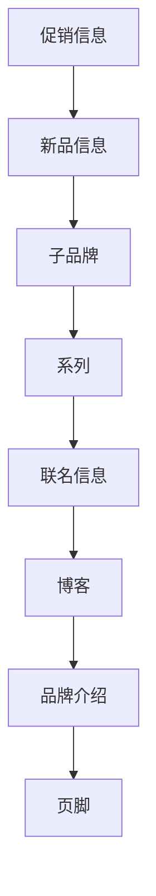
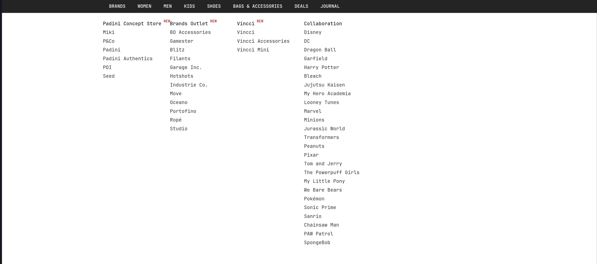
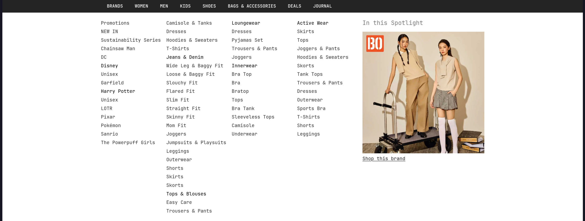
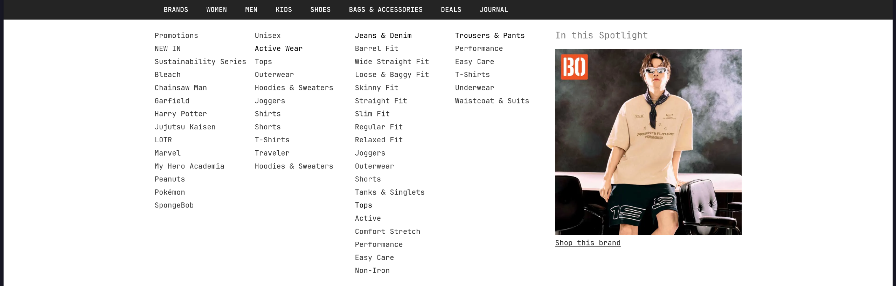
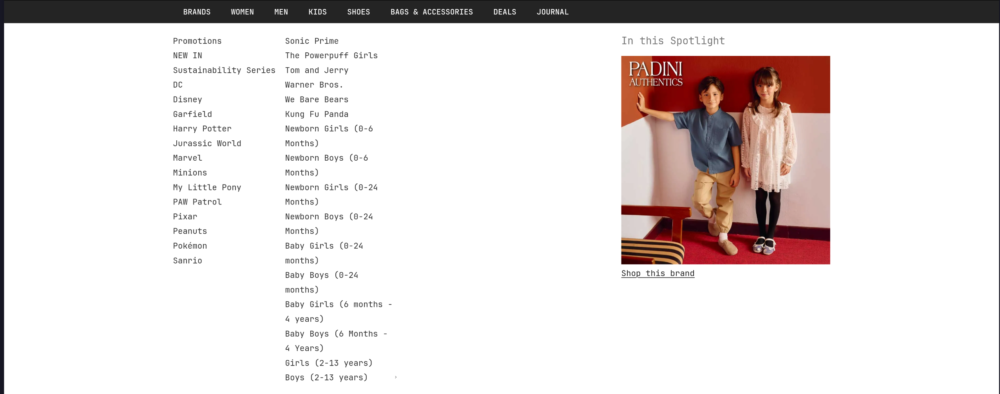
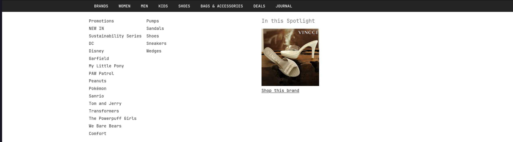
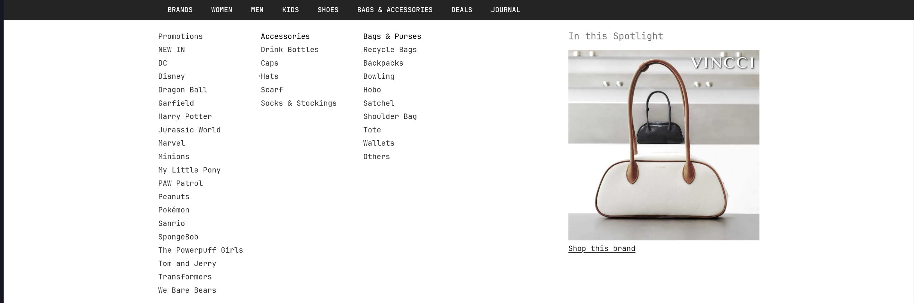
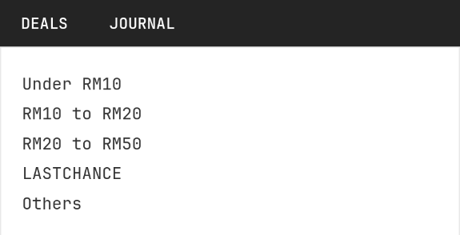

# 内容

## 主页

**布局：**

### 促销信息

用轮播图的方式展现促销的信息，吸引用户眼球，符合品牌定位。

### 新品信息

展示最新产品，提高新品的曝光度。

### 子品牌

1. 通过轮播图展示各个子品牌的特色样式。方便用户快速理解子品牌特点。
2. 促销信息：契合用户追求性价比的需求。
3. Shop by Styles: 通过用图片展示不同的样式让用户能够根据自身需求购买对应的产品。

### 系列

1. 通过轮播图直观展示每个系列的风格。
2. 促销信息：契合用户追求性价比的需求。
3. 分类：提供分类信息让用户能够快速找到符合自己需求的产品。

### 联名

通过轮播图展示联名产品的信息。

### 博客 & 品牌故事

讲述品牌故事，展示品牌文化，加深访客对品牌的了解。

## 子标签页

### BRANDS

### WOMEN

### MEN

### KIDS

### SHOES

### BAG & ACCESSORIES

### DEAL

# 受众

# 修辞